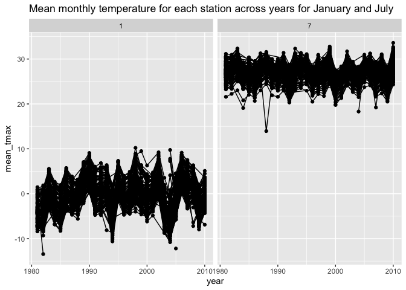
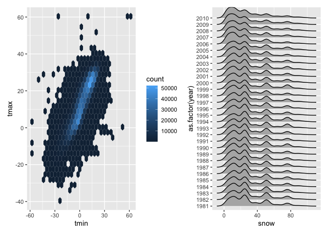
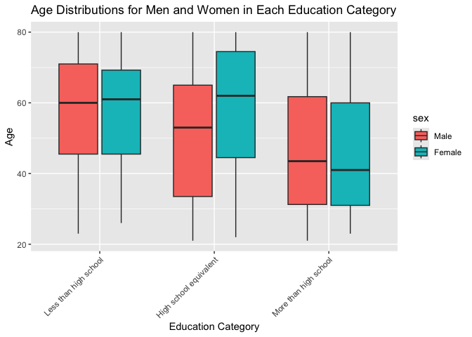
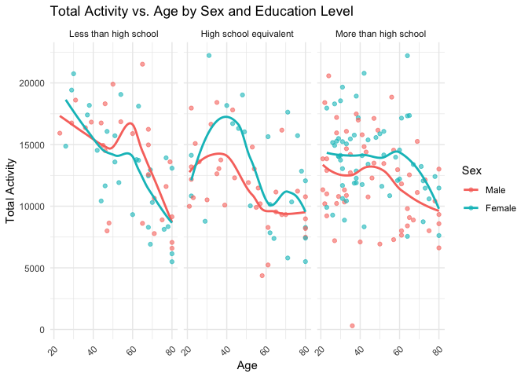
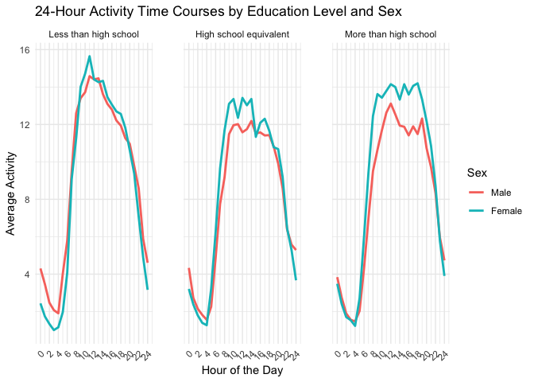
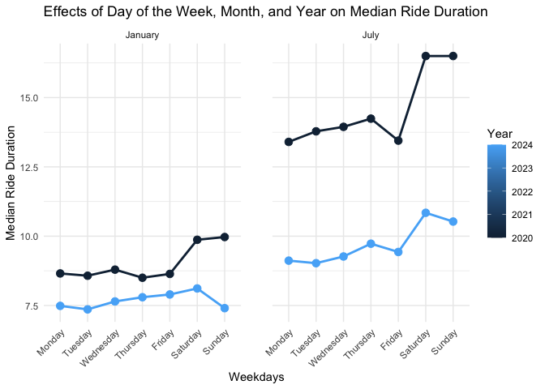
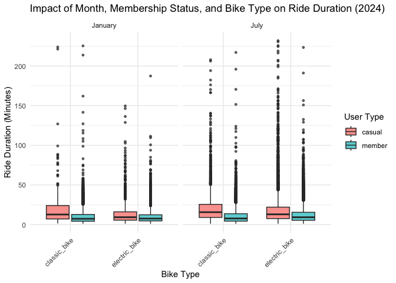

p8105_hw3_ww2744
================
Wenjie Wu

# Problem 1

``` r
data("ny_noaa")
ny_noaa = 
  ny_noaa |>
  janitor::clean_names() |>
  separate(col = date, into = c("year", "month", "day"), sep = "-", , convert = TRUE) |>
  mutate(
    tmax = as.numeric(tmax) / 10,
    tmin = as.numeric(tmin) / 10,
  )

ny_noaa |>
  summarize(
    most_common_snow = names(which.max(table(na.omit(snow))))
  )
```

    ## # A tibble: 1 × 1
    ##   most_common_snow
    ##   <chr>           
    ## 1 0

- The most commonly observed values for snow is `0`, as it is common
  knowledge that the number of days with snowfall in a year is
  relatively few. The second most commonly observed value is `NA`,
  indicating there are still lots of missing data.

``` r
jan_avg = ny_noaa |>
  filter(month == "01") |>
  group_by(id, year) |>
  summarize(avg_tmax_january = mean(tmax, na.rm = TRUE))
```

    ## `summarise()` has grouped output by 'id'. You can override using the `.groups`
    ## argument.

``` r
jul_avg = ny_noaa |>
  filter(month == "07") |>
  group_by(id, year) |>
  summarize(avg_tmax_july = mean(tmax, na.rm = TRUE))
```

    ## `summarise()` has grouped output by 'id'. You can override using the `.groups`
    ## argument.

``` r
ny_noaa |>
  group_by(id, year, month) |>
  filter(month %in% c(1, 7)) |>
  summarize(mean_tmax = mean(tmax, na.rm = TRUE, color = id)) |>
  ggplot(aes(x = year, y = mean_tmax, group = id)) + geom_point() + geom_path() +
  facet_grid(~month) +
  labs(title = "Mean monthly temperature for each station across years for January and July")
```

    ## `summarise()` has grouped output by 'id', 'year'. You can override using the
    ## `.groups` argument.

    ## Warning: Removed 5970 rows containing missing values or values outside the scale range
    ## (`geom_point()`).

    ## Warning: Removed 5931 rows containing missing values or values outside the scale range
    ## (`geom_path()`).

<!-- -->

``` r
hex = 
  ny_noaa |>
  ggplot(aes(x = tmin, y = tmax)) + 
  geom_hex()

ridge = 
  ny_noaa |>
  filter(snow < 100, snow > 0) |>
  ggplot(aes(x = snow, y = as.factor(year))) + 
  geom_density_ridges()

hex + ridge
```

    ## Warning: Removed 1136276 rows containing non-finite outside the scale range
    ## (`stat_binhex()`).

    ## Picking joint bandwidth of 3.76

<!-- --> -
The hex plot shows that most data points are tightly clustered in the
center, with some variability. However, occasional instances where tmax
is less than tmin raise concerns about data quality. The ridge plot
reveals a multimodal distribution of snowfall within a year, with most
stations receiving 0-35 mm of snow.

# Problem 2

``` r
accel_df = read_csv("data/nhanes_accel.csv", na = c("NA", "",".")) |>
  janitor::clean_names()
```

    ## Rows: 250 Columns: 1441
    ## ── Column specification ────────────────────────────────────────────────────────
    ## Delimiter: ","
    ## dbl (1441): SEQN, min1, min2, min3, min4, min5, min6, min7, min8, min9, min1...
    ## 
    ## ℹ Use `spec()` to retrieve the full column specification for this data.
    ## ℹ Specify the column types or set `show_col_types = FALSE` to quiet this message.

``` r
covar_df = read_csv("data/nhanes_covar.csv", na = c("NA", "","."), skip = 4) |>
  janitor::clean_names() 
```

    ## Rows: 250 Columns: 5
    ## ── Column specification ────────────────────────────────────────────────────────
    ## Delimiter: ","
    ## dbl (5): SEQN, sex, age, BMI, education
    ## 
    ## ℹ Use `spec()` to retrieve the full column specification for this data.
    ## ℹ Specify the column types or set `show_col_types = FALSE` to quiet this message.

``` r
nhanes_df = left_join(accel_df, covar_df, by = c("seqn")) |>
  filter(age >= 21) |>
  drop_na(sex, age, bmi, education) |>
  mutate(
    sex = factor(sex, levels = c(1, 2), labels = c("Male", "Female")),
    education = factor(education, levels = c(1, 2, 3),            
                       labels = c("Less than high school", 
                                  "High school equivalent",
                                  "More than high school"
                                  ))
  )

gender_education_table = nhanes_df |>
  group_by(education, sex) |>
  summarize(count = n()) |>
  spread(sex, count, fill = 0) |>
  print()
```

    ## `summarise()` has grouped output by 'education'. You can override using the
    ## `.groups` argument.

    ## # A tibble: 3 × 3
    ## # Groups:   education [3]
    ##   education               Male Female
    ##   <fct>                  <dbl>  <dbl>
    ## 1 Less than high school     27     28
    ## 2 High school equivalent    35     23
    ## 3 More than high school     56     59

``` r
nhanes_df |>
  ggplot(aes(x = education, y = age, fill = sex)) +
  geom_boxplot() +
  labs(
    title = "Age Distributions for Men and Women in Each Education Category",
    x = "Education Category",
    y = "Age"
  ) +
  theme(axis.text.x = element_text(angle = 45, hjust = 1))
```

<!-- -->

- For `less than high school education` and `More than high school`
  group, the age distributions of men and women are relatively similar,
  though women show slightly more concentration around the median.

- For `High shcool equivalent`, the upper and lower bounds of the
  boxplot for the female group are shifted upward compared to the male
  group, indicating that the overall age distribution for women in this
  education level is higher. This suggests that female participants in
  this category tend to be older on average or that women in this
  educational stage may have pursued education at a later age.

``` r
nhanes_activity = nhanes_df |>
  rowwise() |>
  mutate(activity = sum(c_across(starts_with("min")), na.rm = TRUE)) |>
  group_by(seqn, sex, age, education) |>
  summarize(total_activity = sum(activity, na.rm = TRUE))
```

    ## `summarise()` has grouped output by 'seqn', 'sex', 'age'. You can override
    ## using the `.groups` argument.

``` r
ggplot(nhanes_activity, aes(x = age, y = total_activity, color = sex)) +
  geom_point(alpha = 0.6) +  
  geom_smooth(method = "loess", se = FALSE) + 
  facet_wrap(~ education) +  
  labs(
    title = "Total Activity vs. Age by Sex and Education Level",
    x = "Age",
    y = "Total Activity",
    color = "Sex"
  ) +
  theme_minimal() +  
  theme(axis.text.x = element_text(angle = 45, hjust = 1)) 
```

    ## `geom_smooth()` using formula = 'y ~ x'

<!-- -->

- Across all education levels, both men and women show a decline in
  total activity with increasing age. This decline is especially
  pronounced after the age of 60.

- Female participants maintain more stable activity levels over the
  lifespan, with less dramatic declines than men

- Participants with higher education show more stable activity levels
  over time, suggesting that education may correlate with better health
  awareness and sustained physical activity.

``` r
nhanes_df |>
  pivot_longer(
    cols = starts_with("min"),            # Select all columns representing minutes
    names_to = "minute",                  # Create a new column for minute
    names_prefix = "min",                 # Remove the 'min' prefix
    values_to = "activity",               # Create a column for activity values
    names_transform = list(minute = as.integer)  # Convert minute to integer
  ) |>
  mutate(hour = floor(minute / 60)) |>
  group_by(education, sex, hour) %>%
  summarise(avg_activity = mean(activity, na.rm = TRUE)) |>
  ggplot(aes(x = hour, y = avg_activity, color = sex)) +
  geom_line(size = 1) +  # Plot activity over hours as a line
  facet_wrap(~ education) +  # Separate panels for each education level
  labs(
    title = "24-Hour Activity Time Courses by Education Level and Sex",
    x = "Hour of the Day",
    y = "Average Activity",
    color = "Sex"
  ) +
  theme_minimal() +  # Minimal theme for clarity
  theme(
    axis.text.x = element_text(angle = 45, hjust = 1),  # Rotate x-axis text
    panel.spacing = unit(2, "lines")  # Adjust panel spacing
  ) +
  scale_x_continuous(breaks = seq(0, 24, by = 2))
```

    ## `summarise()` has grouped output by 'education', 'sex'. You can override using
    ## the `.groups` argument.

    ## Warning: Using `size` aesthetic for lines was deprecated in ggplot2 3.4.0.
    ## ℹ Please use `linewidth` instead.
    ## This warning is displayed once every 8 hours.
    ## Call `lifecycle::last_lifecycle_warnings()` to see where this warning was
    ## generated.

<!-- -->

- Across all three education levels, the daily activity follows a clear
  diurnal pattern. Activity starts to increase early in the day, peaks
  around midday or early afternoon, and declines toward the evening and
  night hours.

- Female participants exhibit slightly higher levels of activity
  throughout the day compared to males, particularly during the peak
  hours of activity.

- In the `More than high school` group, compared to the other two
  groups, the difference between males and females becomes more
  pronounced. Males show a larger gap in activity levels compared to
  females from midday to evening.

# Problem 3

``` r
jan_2020 = read_csv("data/citibike/Jan 2020 Citi.csv", na = c("NA", "",".")) |>
  janitor::clean_names()
```

    ## Rows: 12420 Columns: 7
    ## ── Column specification ────────────────────────────────────────────────────────
    ## Delimiter: ","
    ## chr (6): ride_id, rideable_type, weekdays, start_station_name, end_station_n...
    ## dbl (1): duration
    ## 
    ## ℹ Use `spec()` to retrieve the full column specification for this data.
    ## ℹ Specify the column types or set `show_col_types = FALSE` to quiet this message.

``` r
jul_2020 = read_csv("data/citibike/July 2020 Citi.csv", na = c("NA", "",".")) |>
  janitor::clean_names()
```

    ## Rows: 21048 Columns: 7
    ## ── Column specification ────────────────────────────────────────────────────────
    ## Delimiter: ","
    ## chr (6): ride_id, rideable_type, weekdays, start_station_name, end_station_n...
    ## dbl (1): duration
    ## 
    ## ℹ Use `spec()` to retrieve the full column specification for this data.
    ## ℹ Specify the column types or set `show_col_types = FALSE` to quiet this message.

``` r
jan_2024 = read_csv("data/citibike/Jan 2024 Citi.csv", na = c("NA", "",".")) |>
  janitor::clean_names()
```

    ## Rows: 18861 Columns: 7
    ## ── Column specification ────────────────────────────────────────────────────────
    ## Delimiter: ","
    ## chr (6): ride_id, rideable_type, weekdays, start_station_name, end_station_n...
    ## dbl (1): duration
    ## 
    ## ℹ Use `spec()` to retrieve the full column specification for this data.
    ## ℹ Specify the column types or set `show_col_types = FALSE` to quiet this message.

``` r
jul_2024 = read_csv("data/citibike/July 2024 Citi.csv", na = c("NA", "",".")) |>
  janitor::clean_names()
```

    ## Rows: 47156 Columns: 7
    ## ── Column specification ────────────────────────────────────────────────────────
    ## Delimiter: ","
    ## chr (6): ride_id, rideable_type, weekdays, start_station_name, end_station_n...
    ## dbl (1): duration
    ## 
    ## ℹ Use `spec()` to retrieve the full column specification for this data.
    ## ℹ Specify the column types or set `show_col_types = FALSE` to quiet this message.

``` r
citi_bike = bind_rows(
  jan_2020 |>
    mutate(month = "January", year = 2020),
  jul_2020 |>
    mutate(month = "July", year = 2020),
  jan_2024 |>
    mutate(month = "January", year = 2024),
  jul_2024 |>
    mutate(month = "July", year = 2024)
) |>
  relocate(year, month) |>
  drop_na(start_station_name, end_station_name, member_casual)
```

- The final dataset contains 73223 rows and 9 columns. The column
  elements contain various information, including the ride date, bike
  type, start and end stations, ride duration, and user type.

- The tidying steps include column names cleaning, merging dataset and
  NA handling.

``` r
citi_bike |>
  group_by(year, month, member_casual) |>
  summarize(total_rides = n()) |>
  spread(member_casual, total_rides, fill = 0) |>
  print()
```

    ## `summarise()` has grouped output by 'year', 'month'. You can override using the
    ## `.groups` argument.

    ## # A tibble: 4 × 4
    ## # Groups:   year, month [4]
    ##    year month   casual member
    ##   <dbl> <chr>    <dbl>  <dbl>
    ## 1  2020 January    980  11418
    ## 2  2020 July      5625  15388
    ## 3  2024 January   2094  16705
    ## 4  2024 July     10843  36200

- The overall trend shows continuous growth, indicating that more and
  more people are choosing Citi Bike as a means of transportation.
  Between January and July of 2020 and 2024, casual riders experienced
  an increase of approximately fivefold. However, due to the larger
  baseline in 2024, the actual number of additional riders is higher in
  2024.

- For members, there was a significant increase in 2024 compared to
  2020, with the total number of members increasing by 16,000, almost
  double the number from July 2020. However, the absolute increase in
  the number of rides between July 2020 and January 2024 was relatively
  small.

``` r
citi_bike |>
  filter(month == "July", year == 2024) |>
  group_by(start_station_name) |>
  summarise(num_rides = n()) |>
  arrange(desc(num_rides)) |>
  slice_head(n = 5) |>
  print()
```

    ## # A tibble: 5 × 2
    ##   start_station_name       num_rides
    ##   <chr>                        <int>
    ## 1 Pier 61 at Chelsea Piers       163
    ## 2 University Pl & E 14 St        155
    ## 3 W 21 St & 6 Ave                152
    ## 4 West St & Chambers St          150
    ## 5 W 31 St & 7 Ave                145

``` r
effects_citi = 
  citi_bike |>
  mutate(
    weekdays = factor(
      weekdays, 
      levels = c("Monday", "Tuesday", "Wednesday", 
                 "Thursday", "Friday", "Saturday", "Sunday"),
      ordered = TRUE  
    )
  ) |>
  group_by(year, month, weekdays) |>
  summarize(median_duration = median(duration, na.rm = TRUE)) |>
  arrange(year, month, weekdays) |>
  print()
```

    ## `summarise()` has grouped output by 'year', 'month'. You can override using the
    ## `.groups` argument.

    ## # A tibble: 28 × 4
    ## # Groups:   year, month [4]
    ##     year month   weekdays  median_duration
    ##    <dbl> <chr>   <ord>               <dbl>
    ##  1  2020 January Monday               8.65
    ##  2  2020 January Tuesday              8.57
    ##  3  2020 January Wednesday            8.79
    ##  4  2020 January Thursday             8.50
    ##  5  2020 January Friday               8.64
    ##  6  2020 January Saturday             9.87
    ##  7  2020 January Sunday               9.97
    ##  8  2020 July    Monday              13.4 
    ##  9  2020 July    Tuesday             13.8 
    ## 10  2020 July    Wednesday           13.9 
    ## # ℹ 18 more rows

``` r
ggplot(effects_citi, aes(x = weekdays, y = median_duration, color = year, group = year)) +
  geom_line(size = 1) +  
  geom_point(size = 3) +  
  facet_wrap(~ month) + 
  labs(
    title = "Effects of Day of the Week, Month, and Year on Median Ride Duration",
    x = "Weekdays",
    y = "Median Ride Duration",
    color = "Year"
  ) +
  theme_minimal() +  
  theme(
    axis.text.x = element_text(angle = 45, hjust = 1), 
    panel.spacing = unit(2, "lines")  
  )
```

<!-- -->

- In `January`, Ride durations are generally shorter and more stable
  throughout the week, staying below 10 minutes for most days.

- In `July`, Ride durations are notably longer, with a clear increase
  during the weekends. This suggests that ride behavior changes
  significantly between winter and summer months, possibly due to
  weather conditions or seasonal activities. `July` shows more
  variability and longer ride durations, likely due to better weather
  and more outdoor activities.

- Ride durations have generally decreased over the years. This might
  reflect changes in user behavior, infrastructure improvements, or new
  transportation policies over time.

``` r
citi_bike |>
  filter(year == 2024) |>
  ggplot(aes(x = rideable_type, y = duration, fill = member_casual)) +
  geom_boxplot(outlier.size = 1, alpha = 0.7) +  
  facet_wrap(~ month) + 
  labs(
    title = "Impact of Month, Membership Status, and Bike Type on Ride Duration (2024)",
    x = "Bike Type",
    y = "Ride Duration (Minutes)",
    fill = "User Type"
  ) +
  theme_minimal() + 
  theme(
    axis.text.x = element_text(angle = 45, hjust = 1)  
  )
```

<!-- -->

- `Casual riders` consistently exhibit longer ride durations compared to
  `Members` across all bike types. This pattern is expected as casual
  riders may use the bikes more for leisure or tourism, while members
  are more likely to use them for commuting or short trips.

- `Electric bikes` have generally shorter ride durations compared to
  classic bikes for both user types. This reflects the convenience and
  faster speeds of electric bikes, which allow users to complete trips
  more quickly.

- The plot reflects the increased availability and popularity of
  electric bikes in 2024, with both members and casual riders making
  significant use of them.

- Across all bike types, some extreme outliers are observed,
  particularly among casual riders. These might represent special
  events, tourist usage, or issues with bike returns, which result in
  abnormally long trips.
